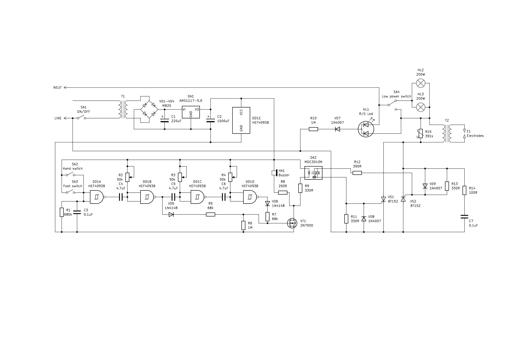

# Spot welder without MCU
## Narek 250A

Here is my 250A (750W) spot welder made from useless microwave oven transformer which is named after comedian  Narek Margaryan (cause it was his oven).

As you can see in pics below a very simple circuitry was used to make it work like commercial welder, with double pulse ruled by NAND Schmitt logic (4093). It has on/off switch, low power switch, 3 control knobs (potentiometers): first (R2) and third (R4) for a pulse length adjustment and the second one (R3) for a delay adjustment between pulses. In order to calculate output signal for each NAND elememt we have to use this formula for R2C4, R3C5 and R4C6 respectively: 

$T=RC \times ln \left ( {V_{High}-V_{T-} \over V_{High}-V_{T+}} \times  {V_{T+} \over V_{T-}} \right ) $

where VT+ is 3.3V, and VT− is 1.65V for 4093 CMOS series.

