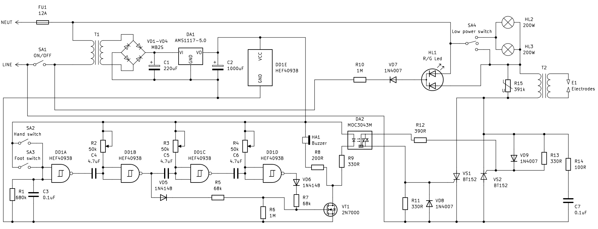

# Spot welder without MCU
## Narek 250A

Here is my 250A (750W) spot welder made from useless microwave oven transformer which is named after comedian  Narek Margaryan (cause it was his oven).

As you can see in pics below a very simple circuitry was used to make it work like commercial welder, with double pulse ruled by NAND Schmitt logic (4093). It has on/off switch, low power switch, 3 control knobs (potentiometers): first (R2) and third (R4) for a pulse length adjustment and the second one (R3) for a delay adjustment between pulses. In order to calculate output signal period for each NAND elememt we have to use this formula for R2C4, R3C5 and R4C6 respectively: 

$T=RC \times ln \left ( {V_{High}-V_{T-} \over V_{High}-V_{T+}} \times  {V_{T+} \over V_{T-}} \right ) $

where V High = 5V, VT+ is 3.3V, and VT− is 1.65V for 4093 CMOS series.

With shown component values we've got ~0.3 sec for pulse length and delay and it's quite enough to weld 0.1-0.2mm thin metal sheet, but if you wanna go hard you may increase R2C4, R3C5, R4C6 values and weld way thicker sheets (even 0.8 mm).

Low power option gives the opportunity to more delicate and precision works (like UHF and SHF projects). HL1 lits green when SA1 is switched on and SA4 in a middle position (T2 disconnected from neutral). When SA4 switched on and T2 connected to neutral thru HL2, HL3 or directly, the second anode (red) of HL1 shunts first (green) and HL1 lits red showing that welder is powered and ready to work. Adjust pulse and delay periods before switching on SA4.  

